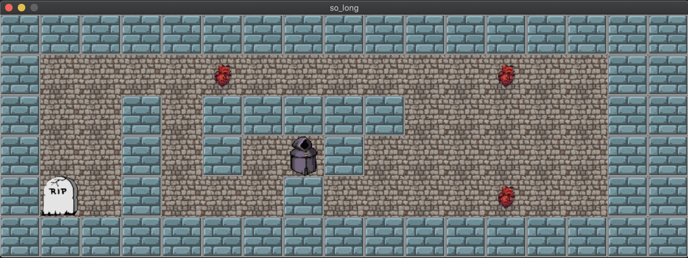

# 🎮 so_long

> A simple 2D game built with C and the MiniLibX graphics library, as part of the 42 School curriculum.  
> You play as a small character who must collect all the coins and reach the exit — but only if the map is valid! 🗚️✨

---

## 🚀 Project Overview

The goal of this project is to build a minimalistic graphical game using only C and the **MiniLibX** library.  
It involves:
- Parsing and validating maps 🧹  
- Handling player movement via keyboard ⌨️  
- Drawing images using MLX 🖼️  
- Managing memory efficiently (no leaks! 💧)

---

## 🔹 How to Play

1. Run the game with a valid `.ber` map:
   ```bash
   ./so_long maps/level1.ber
   ```

2. Use keyboard arrows to move:
   - **W** or ↑: Move up
   - **S** or ↓: Move down
   - **A** or ←: Move left
   - **D** or →: Move right

3. Collect all the coins (**C**), then go to the exit (**E**)!
   - Avoid walls (**1**), and walk on floors (**0**).

---

## 🗂️ Map Rules
Your map must:

- Be rectangular 🔲
- Be surrounded by walls (**1**) 🧱
- Contain exactly one player start position (**P**) 👤
- Contain at least one coin (**C**) 💰
- Contain exactly one exit (**E**) 🚪

Invalid maps will show an error and quit ❌

---

## 📸 Demo 
> Here's a preview of the game:



---

## ⚙️ Compilation

Compile the project using:
```bash
make
```
This will produce the executable `so_long`.

---

## 🧾 Dependencies

This project uses MiniLibX and OpenGL/AppKit (macOS).

If you're on Linux, you'll need to modify the Makefile to use Linux-compatible MLX and link with `-lX11`, `-lXext`, etc.

---

## 📁 File Structure

| File / Folder         | Description                        |
|----------------------|------------------------------------|
| `main.c`             | Entry point of the game            |
| `images.c`           | Loading and destroying textures    |
| `player.c`           | Player movement & input            |
| `map_parser.c`       | Parsing and validating maps        |
| `key_hooks.c`        | Handling keyboard input            |
| `ft_safe_malloc.c`   | Memory management wrapper          |
| `get_next_line*.c`   | Reading map files line by line     |
| `so_long.h`          | Header file for structures & macros|
| `Makefile`           | Build script                       |

---

## ✅ Features

- ✅ Custom memory allocator to avoid leaks
- ✅ Error handling for invalid maps
- ✅ Player position & coin count tracking
- ✅ Smooth movement using keyboard
- ✅ Clean, well-structured code

---

## 🧠 What I Learned

- C graphics programming with MLX 🧱
- Manual memory management in C
- Working with 2D arrays & file parsing
- Game logic design and clean coding structure

---

## 📜 License

This project is part of the 42 Network curriculum and is provided for educational purposes 🎓

---

## 🙋‍♂️ Author

Made by [HAMZA_HAT]  

